```mermaid
flowchart LR
  X["batch.x"] --> E["EdgeProbMLP (grad)"]
  EI["batch.edge_index"] --> E
  E --> P["edge_probs_full"]

  P --> GS["gumbel_softmax_sampling (straight-through)"]
  EI --> GS
  GS --> SEI["sampled_edge_index"]
  GS --> SEW["sampled_edge_weight (straight-through)"]

  X --> G["GNN"]
  SEI --> G
  SEW --> G

  G --> L["loss"]
  SEW --> R1["reg1 BCE"]
  SEI --> R1
  G --> R2["reg2 consistency"]
  SEW --> R2
  R1 --> L
  R2 --> L

  L -.-> G
  L -.-> E
  L -.-> GS
  GS -.-> P
```

# Diagram
Below are corrected, syntax‑valid Mermaid diagrams for the three pipelines. I used solid arrows for forward pass and dashed arrows for backward/grad flow. I also annotated the key differences (straight‑through vs detach vs two‑pass recompute).

**Straight‑Through**

**Hybrid**

**Two‑Pass**

# Full Diagram

Below are full, syntax‑valid Mermaid diagrams for each pipeline, with separate subgraphs for the conditional gate, random baseline branch, and optimizer steps. Solid arrows are forward pass; dashed arrows are backward/grad flow.

**Straight‑Through**

**Hybrid**

**Two‑Pass**

